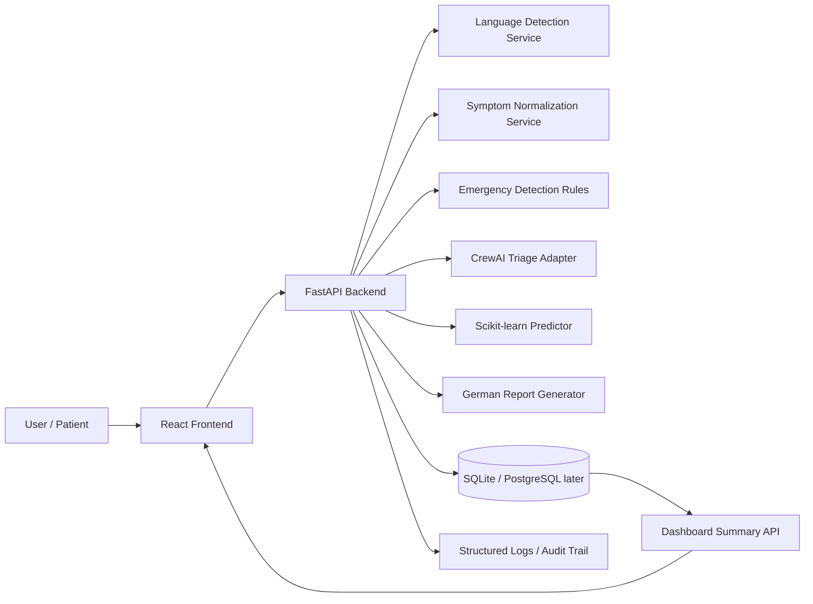

# Architecture Documentation

## System Overview
MediBridge AI is an MVP clinical-triage support system, not a diagnostic authority.
It accepts symptom text in Arabic, German, English, or Turkish and produces:
- Emergency flagging
- Probable disease prediction (ML)
- German doctor-facing summary
- Case storage for audit and dashboarding

## Architecture Diagram

## AI Pipeline
1. Language detection identifies input language.
2. Symptom normalization maps free text into canonical symptom keys.
3. Emergency detection checks critical rules (e.g., chest pain + shortness of breath).
4. ML model predicts probable disease class.
5. Human verification logic is applied to high-risk / low-confidence cases.
6. German report is generated for physician review.
7. Case is stored for tracking and dashboard insights.

## Human Oversight by Design
- High-risk cases require human verification.
- Low-confidence model outputs require human verification.
- AI output is advisory; clinical decisions must be made by qualified professionals.

## Explainability Approach (MVP)
- Rule-based emergency reasons are explicitly returned.
- Normalized symptom list is returned.
- Model confidence is returned.
- This supports clinician interpretation and auditability.

## Known Technical Limits
- Limited MVP training samples for ML model.
- Simple lexical normalization may miss phrasing variants.
- No full medical history context integration yet.
- No NLLB translation pipeline yet (planned).

## Planned Next Steps
- PostgreSQL + role-based access controls
- Strong auth (JWT + refresh strategy)
- LLM/NLLB translation layer
- Advanced evaluation metrics and drift monitoring
- ChromaDB/RAG extension for knowledge-grounded reasoning
