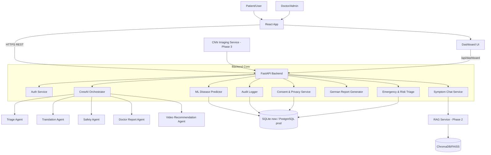
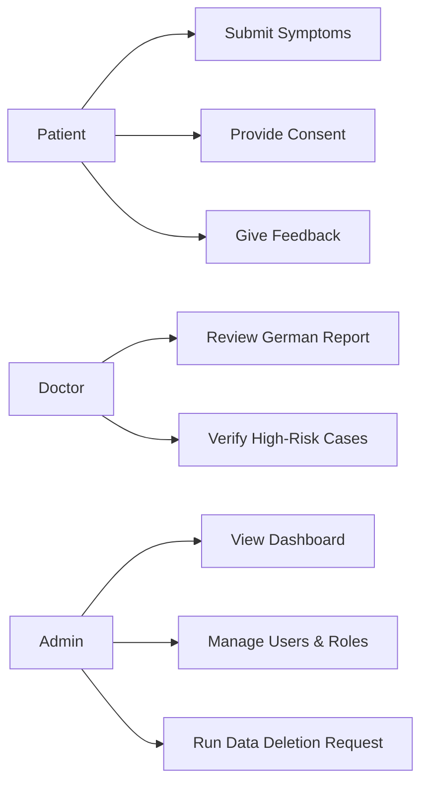
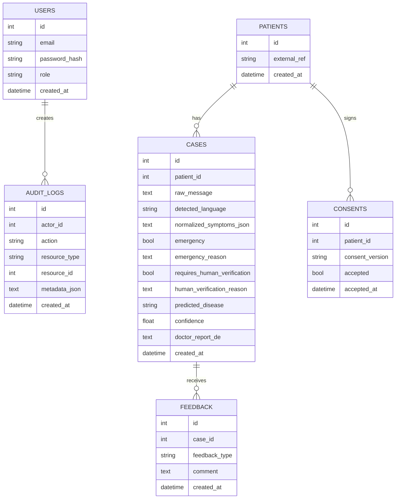

# MediBridge AI - Full System Blueprint

## 1) Full Architecture Diagram


## 2) 6-Month Roadmap
- Month 1: Stabilize MVP, auth, consent, delete API, audit logs.
- Month 2: Improve multilingual normalization, dataset v1, model evaluation baseline.
- Month 3: Introduce RAG medical knowledge retrieval (read-only, cited output).
- Month 4: Deploy PostgreSQL, role-based access, production security hardening.
- Month 5: CNN prototype for image triage (non-diagnostic), calibration and explainability.
- Month 6: Clinical pilot readiness package (DPIA, model cards, incident playbooks, validation report).

## 3) Folder Structure
```text
medibridge-ai/
├── backend/
│   ├── app/
│   │   ├── main.py
│   │   ├── agents/
│   │   ├── ml/
│   │   ├── services/
│   │   ├── database/
│   │   ├── schemas/
│   │   ├── api/
│   │   └── core/
│   ├── tests/
│   └── requirements.txt
├── frontend/
│   └── react-app/
│       ├── src/
│       │   ├── pages/
│       │   ├── components/
│       │   ├── hooks/
│       │   ├── api/
│       │   └── styles/
├── datasets/
├── notebooks/
├── docs/
└── .github/
    └── workflows/
```

## 4) Database Schema (Core)
- users(id, email, password_hash, role, created_at)
- patients(id, external_ref, created_at)
- cases(id, patient_id, raw_message, detected_language, normalized_symptoms_json, emergency, emergency_reason, requires_human_verification, human_verification_reason, predicted_disease, confidence, doctor_report_de, created_at)
- feedback(id, case_id, feedback_type, comment, created_at)
- consents(id, patient_id, consent_version, accepted, accepted_at)
- audit_logs(id, actor_id, action, resource_type, resource_id, metadata_json, created_at)

## 5) Agent List
- Intake Agent: validates completeness, asks follow-up.
- Translation Agent: multilingual normalization/translation.
- Triage Agent: emergency/risk determination.
- Disease Prediction Agent: invokes ML scoring and confidence checks.
- Safety Agent: blocks unsafe outputs, enforces disclaimer.
- Doctor Report Agent: produces German physician summary.
- Video Recommendation Agent (phase 2+): exercises/physio/stress videos.
- Compliance Agent: consent, retention, deletion workflow checks.

## 6) Use Case Diagram


## 7) ERD


## 8) Full Tech Stack
- Frontend: React + Vite
- Backend: FastAPI + Pydantic
- Agents: CrewAI
- ML: scikit-learn
- CNN/DL: PyTorch (phase 3)
- DB: SQLite (MVP), PostgreSQL (production)
- Cache/Queue (phase 2): Redis + Celery/RQ
- RAG (phase 2): LangChain or LlamaIndex + ChromaDB/FAISS
- Observability: structured logs + Prometheus/Grafana (phase 3)
- Security: JWT, bcrypt, RBAC, HTTPS via reverse proxy

## 9) ML Training Plan
- Data sources: symptom-condition datasets + curated multilingual mappings.
- Preprocessing: normalization, tokenization, language-aware cleaning.
- Baselines: LogisticRegression, LinearSVC, XGBoost-light.
- Metrics: macro F1, recall for emergency-related classes, calibration error.
- Validation: stratified split + cross-validation + error analysis slices by language.
- Safety gates: min recall threshold for critical classes before release.

## 10) CNN Training Plan
- Scope: image triage assistance only (non-final diagnosis).
- Data: de-identified public datasets with documented licenses.
- Model: EfficientNet/ResNet baseline + Grad-CAM explainability.
- Metrics: sensitivity, specificity, AUROC, subgroup bias checks.
- Clinical safeguards: mandatory human review; no autonomous decision.

## 11) Prompt Engineering Guidelines
- System prompt: "AI assistant with human oversight, never autonomous diagnosis."
- Output policy: neutral, non-prescriptive medication language.
- Mandatory fields: confidence, limitations, follow-up advice, disclaimer.
- Guardrails: unsafe medical instructions blocked by Safety Agent.

## 12) Backend APIs (Target)
- `POST /api/auth/register`
- `POST /api/auth/login`
- `POST /api/chat`
- `GET /api/cases/{id}`
- `POST /api/feedback`
- `GET /api/dashboard/summary`
- `DELETE /api/cases/{id}` (GDPR erase)
- `GET /health`

## 13) React UI Plan
- Pages: Login, Symptom Chat, Case Detail, Dashboard, Admin.
- Components: MessageBox, RiskBadge, ReportPanel, FeedbackButtons, ConsentModal.
- UX rules: simple language, clear emergency escalation, always visible disclaimer.

## 14) Dashboard Scope
- KPIs: total cases, emergency count, verification pending count, language distribution.
- Quality: model confidence distribution, feedback quality trends.
- Compliance: consent rate, deletion requests, audit-log events per day.

## 15) Professional GitHub Plan
- Branch model: `main`, `develop`, `feature/*`, `hotfix/*`.
- PR policy: template + required reviews + CI checks.
- CI: lint, tests, type checks, security scan.
- Versioning: Semantic Versioning + release notes.
- Project management: GitHub Projects milestones aligned to 6-month roadmap.
